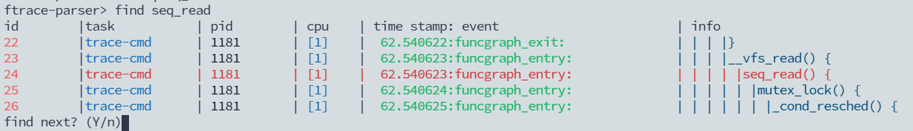
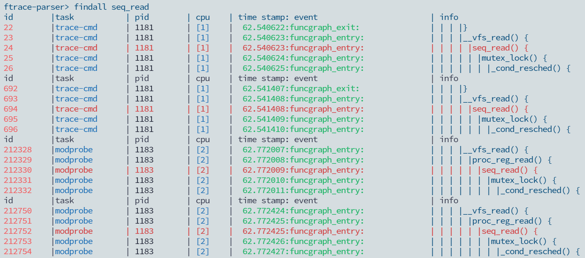
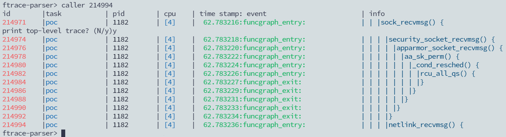
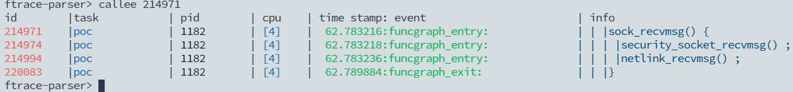
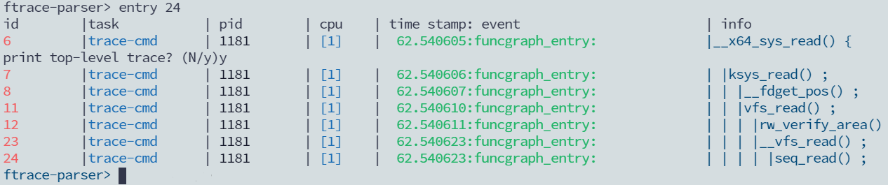
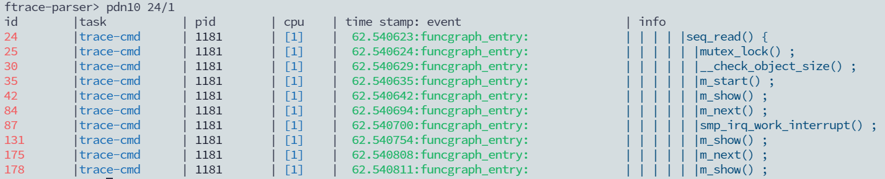
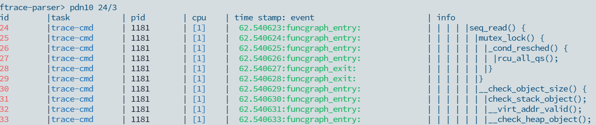
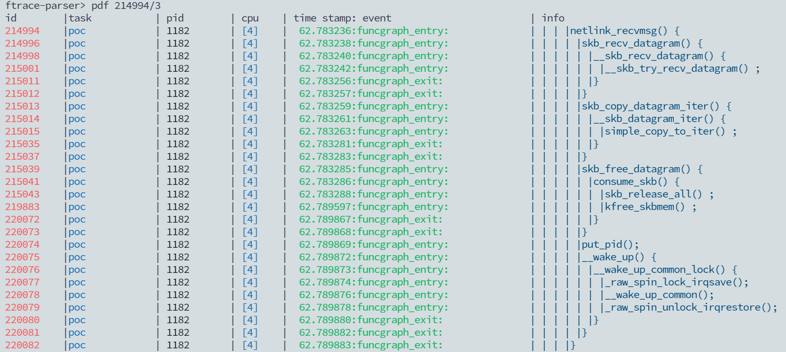
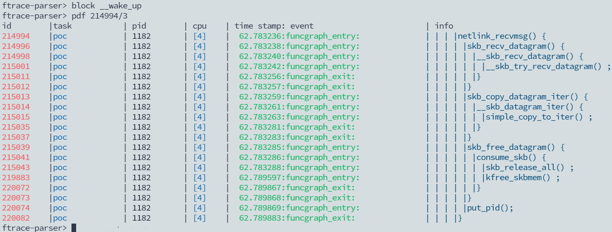
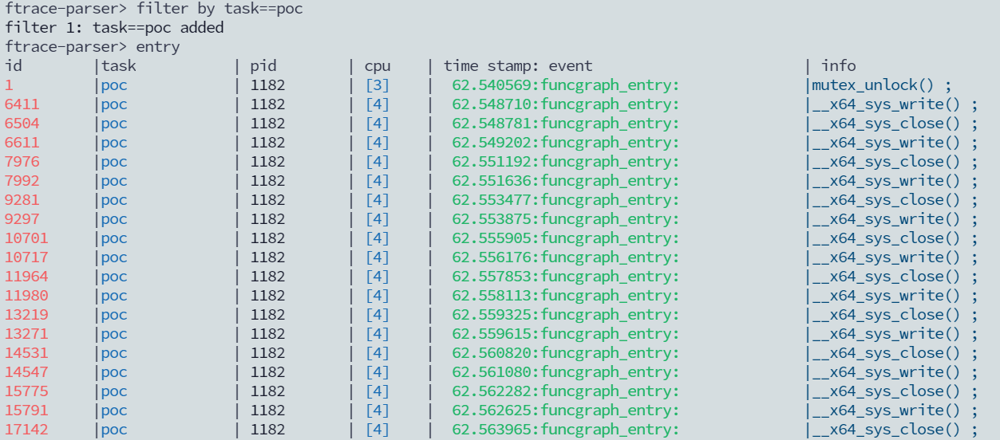

# FtraceParser

`ftraceparser` is a python package that convert Linux kernel ftrace report to a human readable format.

## Install

The package can be installed through pip (**recommended**)

`pip3 install ftraceparser`

You can also download the latest release from Github

## Introduction

Ftrace is a kernel trace tool on Linux kernel, it's wildly used for kernel debugging. 

The existed ftrace parsers like  `KernelShark` are powerful but lack of customization for daily debugging use (e.g., match each function entry to function exit), and most important, they do not provide a programming interface in terms of extensibility.

`ftraceparser` manages to provide a user-friendly python interface for parsing ftrace reports. It takes `trace-cmd` report as the input, and produce a easily-use internal console for inspection.

## Usage

1. [Convert to report](#convert_to_report)
2. [Open report](#open_a_ftrace_report)
3. [List entry functions](#list_entry_functions)
4. [Find function](#find_functions)
5. [Caller](#caller)
6. [Callee](#callee)
7. [Single entry of a function](#entry_of_a_function)
8. [Print nodes](#print_nodes)
9. [Print a function](#print_function)
10. [Block functions](#block_functions)
11. [Delete block rules](#delete_blocks)
12. [Add filters](#add_filter)
13. [Remove filters](#remove_filter)

There are some important features that `ftraceparser` provided.

<a name="convert_to_report"></a>

### Convert to trace-cmd report

This step convert `trace-cmd.dat` to `trace.report`.

For more information, visit https://www.trace-cmd.org/

```
trace-cmd report > trace.report
```

<a name="open_a_ftrace_report"></a>

### Open a ftrace report

```
python3 ftraceparser ./trace.report
```

###  

<a name="list_entry_functions"></a>

### List all entry functions

```
ftrace-parser> entry
```


<a name="find_functions"></a>

### Find functions

```
ftrace-parser> find [FUNCTION_NAME]
```



To find all occurrences, use `findall`



<a name="caller"></a>

### Show the caller of a function

```
ftrace-parser> caller [ID]
```



<a name="callee"></a>

### Show the callees of a function

```
ftrace-parser> callee [ID]
```



<a name="entry_of_a_function"></a>

### Find the entry function of a function

Find the entry function of this `seq_read()` which has the id of 24

```
ftrace-parser> entry [ID]
```



<a name="print_nodes"></a>

### Print N nodes from somewhere

`pdn` will print `N` nodes from node `ID`, `LEVEL` controls how many levels of callee you want enter.

```
ftrace-parser> pdn[N] [ID]/[LEVEL]
```

For example, to print 10 nodes from node 24 with entering only level 1 callee




If we enter level 3 callee, we will get more details.



<a name="print_function"></a>

### Print the entire function

`pdf` prints the entire function `ID` with `LEVEL` callee

```
ftrace-parser> pdf [ID]/[LEVEL]
```



<a name="block_functions"></a>

### Block some functions

Sometimes, we don't want to show every function. To block a function from showing, use `block` command.

```
ftrace-parser> block [FUNCTION_NAME]
```



<a name="delete_blocks"></a>

### Delete block functions

To delete just one block function, use `delete` command following with the function name you want to delete.

```
ftrace-parser> delete [FUNCTION_NAME]
```

To delete all functions that have been blocked, just use `delete` followed by nothing

```
ftrace-parser> delete
```

<a name="add_filter"></a>

### Filter

`ftraceparser` provide filter by task, pid, cpu, time stamp, event and entry

```
ftrace-parser> filter by [EXPR]
```

For example, we only want to show the trace of task `poc`




Or we want to show the trace of pid between 1200 and 1220 


<a name="remove_filter"></a>

### Remove filters

To remove some filter, use `filter-d` command and follow it with the filter

```
ftrace-parser> filter-d [task|pid|cpu|time_stamp|event|entry]
```

To remove them all, just use `filter-d`

```
ftrace-parser> filter-d
```

